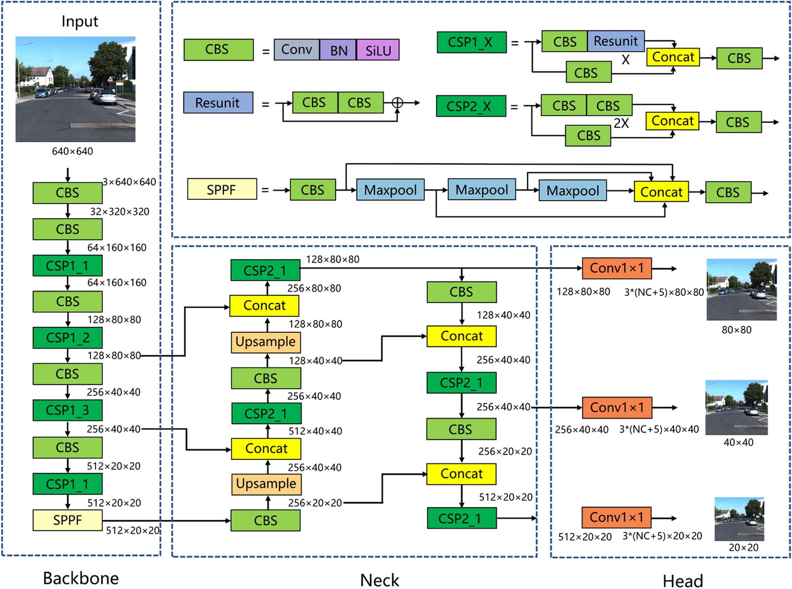
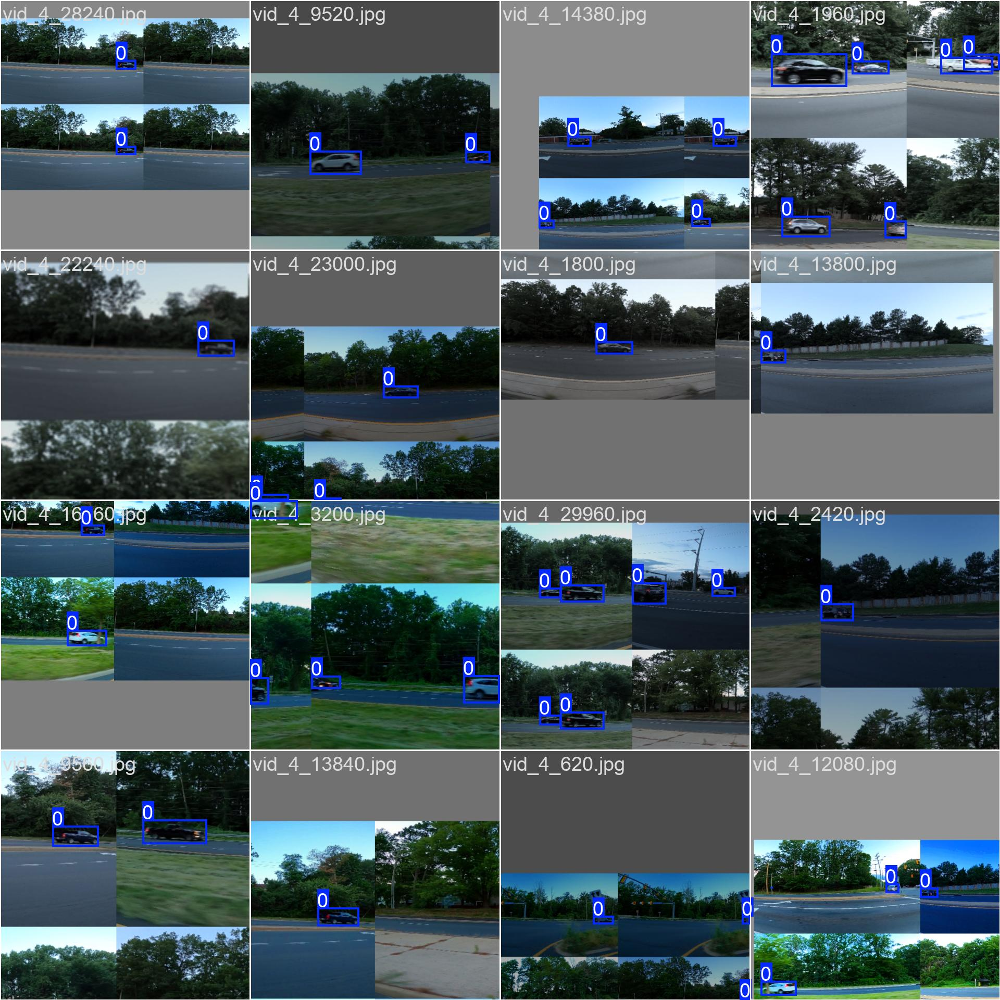
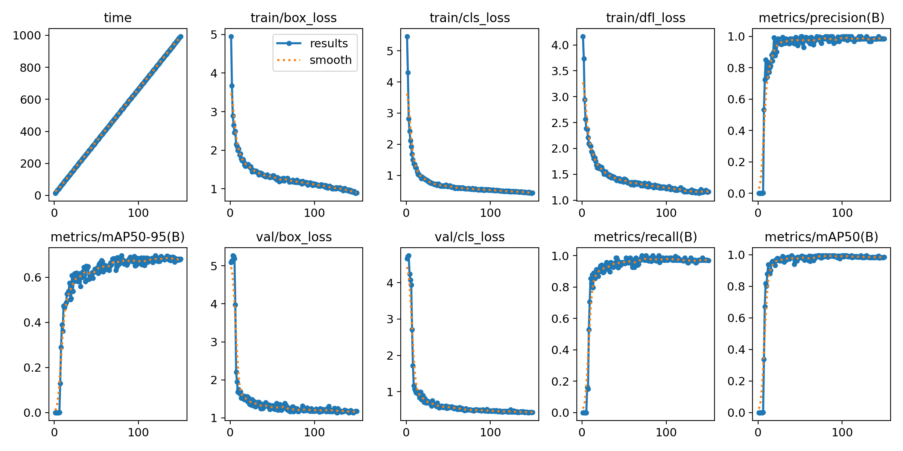
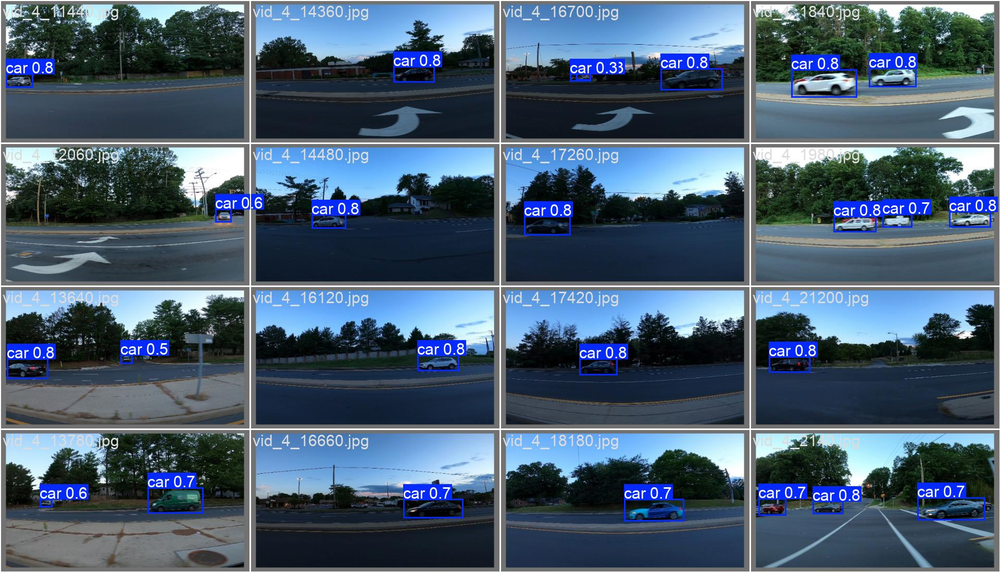
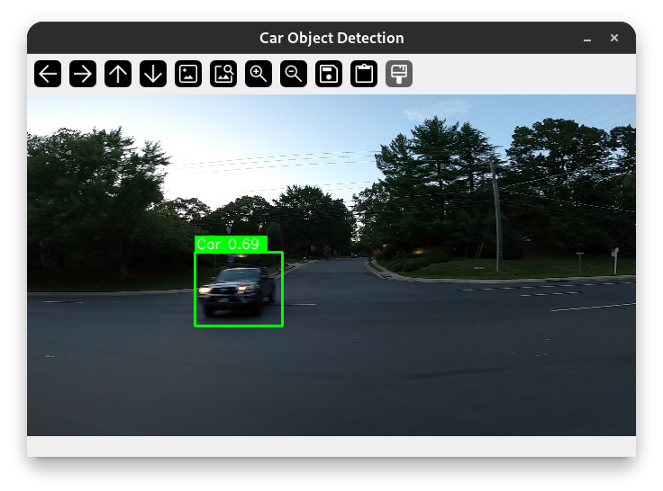

# Car Object Detection with YOLOv5

This repo contains implementation of car object detection task. I used this [dataset](https://www.kaggle.com/datasets/sshikamaru/car-object-detection) to train YOLOv5 from scratch without pretraining. 

## YOLOv5 architecture

[YOLOv5](https://docs.ultralytics.com/yolov5/) is a state-of-the-art architecture for object detection, known for its high speed and accuracy



## Dataset overview



It includes standard ultralytics augmentation techniques (based on [albumentations](https://github.com/albumentations-team/albumentations)) such as Blur, CLAHE, Mosaic etc.

## Training results



You can find the rest of the metrics in [runs/detect/train](runs/detect/train)

## Evaluation

Validation batch:


Inference results on test images:


## Usage

```
options:
  -h, --help            show this help message and exit
  -t, --train           switch to training mode
  -b, --batch_size      set batch size
  -e, --epoch           set epochs number
  -is, --imgsz          set image size
  -p, --params_path     set path to pretrained params
  -r, --root_dir        set path to data root directory
  -l, --labels          set path to labels fil
```

### Training

To train model, run the following command:

```bash
$ python main.py -t --batch_size BATCH_SIZE --epoch EPOCH
```

### Inference 

To evaluate the trained model, run:

```bash
$ python main.py
Inference mode
Path to image: CarObjDetection/testing_images/vid_5_29820.jpg   
```

